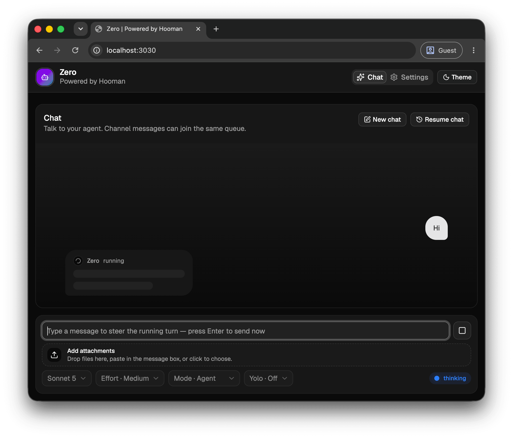

<div align="center">

# Zero

Web UI for **Hooman**: chat with your agent, manage MCP servers and skills, and tune configuration—built with [Next.js](https://nextjs.org/), React, and TypeScript.

[](https://nodejs.org/)
[](https://github.com/vaibhavpandeyvpz/zero/actions/workflows/ci.yml)
[](LICENSE)

</div>

<p align="center">
  
</p>

## Related

**Want the terminal-first agent** with same multi-channel runtime, MCPs, skills, local coding agent? Use [**Hooman**](https://github.com/vaibhavpandeyvpz/hooman) — [README](https://github.com/vaibhavpandeyvpz/hooman#readme).

## Requirements

- **Node.js** ≥ 24 (see `engines` in [`package.json`](package.json))

## Quick start

```bash
npm ci
npm run build
npm start
```

Adjust scripts for developer v/s deployment (see [`package.json`](package.json) `dev` / `start`).

## Contributing

Contributions are welcome. Please read [CONTRIBUTING.md](CONTRIBUTING.md) and [CODE_OF_CONDUCT.md](CODE_OF_CONDUCT.md) before opening issues or pull requests.

## Security

Report security issues responsibly—see [SECURITY.md](SECURITY.md).

## License

[MIT](LICENSE) © [Vaibhav Pandey](mailto:contact@vaibhavpandey.com)
